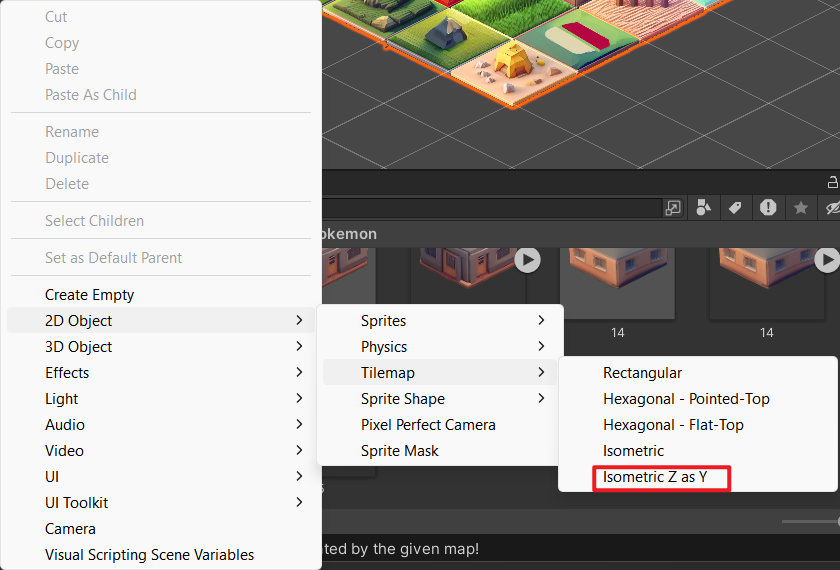

# Tile Platform Generation

## 1. Scenario 

### Plan

### Install in Unity

- [Overviewing the API](https://help.scenario.com/overviewing-the-api)
- [Installing the Unity Plugin](https://help.scenario.com/installing-the-unity-plugin)

After installation, all the panels appear in `Window/Scneario/...`

### Unity Tutorial

- [Creating Isometric 2D Tiles for Game Maps and Levels in Unity](https://help.scenario.com/creating-isometric-2d-tiles-for-game-maps-and-levels-in-unity-a-comprehensive-guide)
- [Creating Platformer Game Levels Using Scenario and Unity](https://help.scenario.com/creating-platformer-game-levels-using-scenario-and-unity)
- [Creating Animated Assets Using Basic 3D Models and Spritesheets](https://help.scenario.com/creating-animated-assets-using-basic-3d-models-and-spritesheets)

## 2. Isometric Tilemap Setting

### Display Setting

Follow the steps of [Creating Isometric 2D Tiles for Game Maps and Levels in Unity](https://help.scenario.com/creating-isometric-2d-tiles-for-game-maps-and-levels-in-unity-a-comprehensive-guide)

- Decide your isometric grid rate for X, Y and Z
  - Typically, they are 1:0.5:1
- Prepare a base isometric tile in the same rate 1:0.5:1
  - 	
- Set the tile palette to be the same rate\

### Perspective Setting

- Edit/Project Settings/Graphics/Camera Setting
  
  Set the Transparency Sort Mode and Axis as shown

- Under the Hierarchy panel. Right Click -> 2D Object -> Tilemap -> Isometric Z as Y
  

- Find the Tilemap Renderer

  Set the Sort Order=Top Right, Mode = Individual
  

### Tileset Preparation

> What about animated tile to add more dynamic?

Pokémon Tileset

2D -> 2.5D Effect

	

## 3. How To Use

1. Select the Tilemap you have generated
2. Under the same Gameobject which contain the `Tilemap` component. Add the `Tilemap Generator` Script
3. Follow the guidance to set the tileset and the map
   
   - 
   
   - Keep the name of each tile as number in both tile assets and in the tilemap
4. You can freely click the `Update Tileset`, `Update Tilemap Array`, `Clean Tilemap`, and `Random 5x5 Tilemap` in editor to see what happens

 
